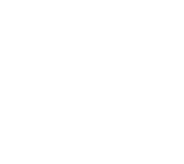

  
  <h1 align='center'>LETA</h1>
  

    Don't waste time looking at what you are typing, spend time thinking about the meaning.
  

  

## About

You will be able to:
- Practice touch typing
- Pick best keyboard layout for yourself
- Create own keyboard layout with analysis
- Download layout files for any OS

 

## Steps

- [x] Technical requirements [->](./docs/mds/tech-requirements.md)
- [ ] Design [->](https://www.figma.com/file/CIx1UK6ndPDBPQL9wDGQA6/leta-design?node-id=0%3A1)
- [x] Logo
- [ ] Database structure [->](./docs/mds/db-structure.md)
- [x] Tech stack definition [->](./docs/mds/tech-stack.md)
- [ ] Functional development

 

## Functions

- [x] Export layout to files:
  - [x] Windows (.klc)
  - [x] MacOS (.keylayout)
  - [x] Linux (.xmodmap)
- [x] Auth
- [x] Analyze layout
- [ ] Typing test
- [ ] Layout installers for:
  - [ ] Windows
  - [ ] MacOS

 

## Tech Stack

Frontend:
- [Next.js](https://nextjs.org/learn/basics/create-nextjs-app/setup)
- [Typescript](https://nextjs.org/learn/excel/typescript/create-tsconfig)
- [Tailwind](https://tailwindcss.com/docs/installation/framework-guides)
- [Valtio](https://valtio.pmnd.rs/)

Backend:
- [Supabase](https://app.supabase.com/)
- [Genkey api](https://github.com/roman-koshchei/genkey-api)

 

## Like what you're seeing?

We're hoping to turn this into our full-time job! Support us on [Open Collective](https://opencollective.com/paragoda). And we will be able to buy domain (leta.pro)
