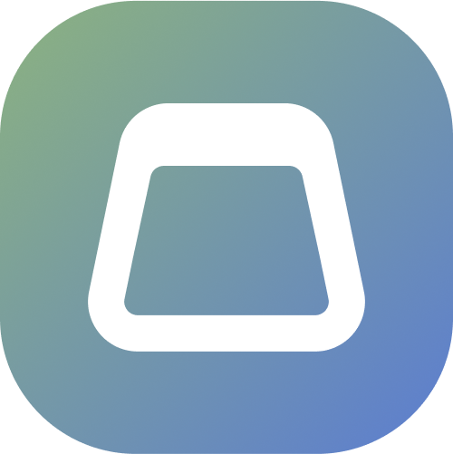

  
  <h1 align="center">LETA</h1>
  

    Don't waste time looking at what you are typing, spend time thinking about the meaning.
  

## About

You will be able to:
- Practice touch typing
- Pick best keyboard layout for yourself
- Create own keyboard layout with analysis
- Download layout files for any OS

## Steps

- [x] Technical requirements [->](./docs/tech-requirements.md)
- [ ] Design [->](https://www.figma.com/file/CIx1UK6ndPDBPQL9wDGQA6/leta-design?node-id=0%3A1)
- [x] Logo
- [ ] Database structure [->](./docs/db-structure.md)
- [x] Tech stack definition [->](./docs/tech-stack.md)
- [ ] Architecture
- [ ] Functional development

 
## Like what you're seeing?

We're hoping to turn this into our full-time job! Support us on [Open Collective](https://opencollective.com/paragoda)
