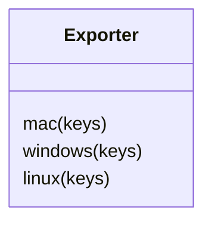
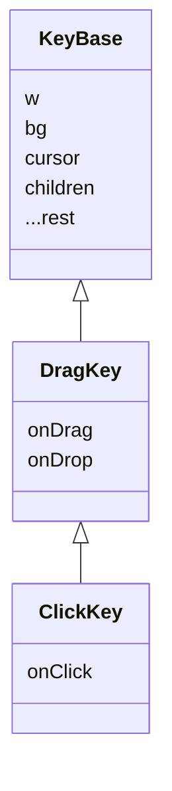

# Create Layout

```mermaid
classDiagram
class Exporter {
  mac(keys)
  windows(keys)
  linux(keys)
}
```

# Keyboard

1. just for show: Key must have nothing

2. for swap: Key must have `onDrag`, `onDrop`

3. for change each: Key must have `onClick`, `onDrag`, `onDrop`

```mermaid 
classDiagram
  KeyBase <|-- DragKey
  DragKey <|-- ClickKey
  class KeyBase {
    w
    bg
    cursor
    children
    ...rest
  } 
  class DragKey {
    onDrag
    onDrop 
  } 
  class ClickKey {
    onClick
  }
```